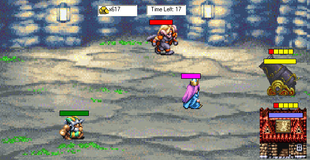



## Fortress \- Defend the base

### Description

This game will learn you alot of beginners stuffs, also Saving, Sound and other more advanced things.

Objective:

Shoot the enemies by clicking on them, but remember don't let the enemies attack your house, if it's destroyed then you loose. On the other hand it's quite important to protect the cannon too, because if it's destroyed then you won't shoot as much damage as you would do with an.
 
### More Info
 

             |
---                |---
**Submitted On**   |2005-06-26 16:48:12
**By**             |[Andreas Engvall](https://github.com/Planet-Source-Code/PSCIndex/blob/master/ByAuthor/andreas-engvall.md)
**Level**          |Beginner
**User Rating**    |5.0 (10 globes from 2 users)
**Compatibility**  |VB 4\.0 \(16\-bit\), VB 4\.0 \(32\-bit\), VB 5\.0, VB 6\.0
**Category**       |[Games](https://github.com/Planet-Source-Code/PSCIndex/blob/master/ByCategory/games__1-38.md)
**World**          |[Visual Basic](https://github.com/Planet-Source-Code/PSCIndex/blob/master/ByWorld/visual-basic.md)
**Archive File**   |[Fortress\_\-1905866262005\.zip](https://github.com/Planet-Source-Code/andreas-engvall-fortress-defend-the-base__1-61345/archive/master.zip)

